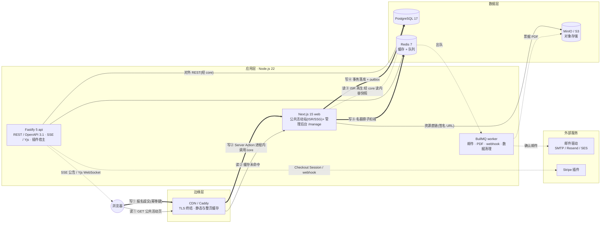

# 第 2 章 · 总体架构与技术选型

本章给出 yuMeet 的整体形态:一张架构总览图、内容面与工作流面的分离方式、逐项写明取舍的技术选型表、monorepo 目录结构、单机与 SaaS 两种运行形态,以及贯穿全系统的两条关键数据流。所有决策服从第 1 章的原则序:headless 分离(原则 1)与运维趋零(原则 8)是本章的主导约束。

## 2.1 架构总览

yuMeet 的生产形态是七个容器:caddy、web、api、worker、postgres、redis、minio,外加可插拔的邮件驱动与 Stripe 插件两类外部依赖(部署细节见第 11 章)。下图中,**细实线为公共页读路径(读①—③)**,**粗实线为报名写路径(写①—④)**,虚线为异步与再生流量;两条路径的逐步展开见 2.6 节。



三点阅读提示:其一,web 与 api 之间没有内部 RPC——页面内的一切数据操作由 Server Actions 在进程内调用 `packages/core` 完成,类型安全由 monorepo 共享类型保证;api 收窄为三件事:对外 REST(OpenAPI 3.1)、SSE 与 Yjs 实时长连接、插件 HTTP 挂载点,并作为第三方集成与高并发报名/抢票的流量入口独立水平扩容;其二,worker 是唯一发出邮件与生成 PDF 的进程,请求线程里没有任何慢 IO(对照 1.1 问题 3);其三,Stripe 与邮件驱动都在核心之外,以插件与驱动接口接入,缺席时系统降级为免费票与日志投递,而非启动失败。

## 2.2 内容面 / 工作流面分离

yuMeet 把系统切成两个面,对应第 1 章原则 1:

- **内容面**:公共活动站。消费的是「已发布快照」——组织者点击发布时,发布这一 Server Action 经 `packages/core` 将活动的公开信息(页面、日程、讲者、资料)投影为一份可缓存的只读结构,写入内容表并调用 Next.js 的 `revalidateTag('event:{id}')` 使旧页失效。内容面匿名可读、可被 CDN 整页缓存、可被模板包整体换肤(第 7 章),也天然满足归档要求(第 5 章):快照不依赖工作流面存活。
- **工作流面**:`/manage` 后台与全部写 API。承载注册、评审、日程草稿等状态机(9.4),每一次访问都经过对象级授权中间件(12.2),不可缓存、不对匿名开放。

两个面共享同一 PostgreSQL 实例但不共享表:工作流表(如 `registration`、`review`)与内容快照表之间只有「发布」这一个单向投影动作。由此得到三个工程收益:高并发读永远打不到工作流表(13.2 的缓存策略以此为前提);模板系统只需面对稳定的快照 schema,与业务演进解耦;安全审计时,「匿名可达的数据」有一条清晰的物理边界。草稿态的预览走工作流面渲染同一套组件,带 `noindex` 与授权校验,不产生快照。

> **设计要点**:发布是显式动作而非「保存即上线」。组织者在 /manage 中的一切编辑默认只影响草稿,公共站永远呈现最近一次发布的快照。这一决策同时服务状态透明(参会者看到的版本有明确时间戳)与缓存失效(失效点唯一)。

## 2.3 技术选型表

逐项写清「选了什么、为什么、放弃了什么」。未列出的候选(如未认真评估的框架)不写入,避免伪对比。所有版本号为写作时的目标版本,升级策略见 11.5。

| 领域 | 选型 | 为什么 | 放弃了什么、为什么 |
| --- | --- | --- | --- |
| 语言 / 运行时 | TypeScript 5.x + Node.js 22 LTS | 单语言全栈,类型从 Drizzle schema 经 packages/core 一路贯穿到 React 组件;22 为 LTS,支持至 2027 | Bun/Deno:生态与长期支持不足;Python:即回到 Indico 栈,且失去端到端类型 |
| Monorepo | pnpm + Turborepo | workspace 协议 + 内容寻址缓存,CI 增量构建 | Nx:功能超需求、约定重;Lerna:仅版本管理,无任务编排 |
| Web 框架 | Next.js 15(App Router)+ React 19(RSC) | ISR/SSG 直接实现内容面静态化;RSC 压低公共页客户端 JS;单应用同时承载公共站与 /manage | Remix/SvelteKit:缺少等价的 ISR 与标签失效;双应用拆分:部署容器数翻倍,违背原则 8 |
| 样式 | Tailwind CSS v4 + CSS custom properties | design tokens 以原生 CSS 变量暴露,模板包可整体覆盖(7.2) | CSS-in-JS:运行时开销且与 RSC 不兼容 |
| 组件层 | Radix Primitives 封装为 Cupertino UI | 无样式原语保证可访问性基线,视觉层自持以达成 Cupertino 基准(第 8 章) | MUI/Ant Design:自带强视觉语言,改造成本高于自建薄封装 |
| 动效 | Motion(motion.dev)+ CSS `spring()` | 声明式 spring 曲线,原生 CSS 优先、JS 兜底(8.4);`spring()` 尚无稳定实现,现阶段经 `linear()` 落地 | GSAP:许可与体积;纯 CSS transition:表达力不足以覆盖手势联动 |
| API 服务 | Fastify 5 + Zod | 只承担对外 REST、SSE/Yjs 长连接与插件挂载三件事;schema 一次声明,同时得到运行时校验、类型与 OpenAPI 生成;吞吐充足,可独立水平扩容 | Express:性能与维护节奏;NestJS:装饰器抽象层对收窄后的 api 职责是纯开销 |
| 内部调用 | Server Actions + packages/core 进程内调用(放弃 tRPC:同进程自调无需网络胶水) | 页面内数据操作零网络开销、无代码生成步骤,类型安全由 monorepo 共享类型保证 | GraphQL:对单一消费方是纯开销(网关、N+1、缓存复杂度) |
| 对外 API | REST + 自动生成 OpenAPI 3.1 | 第三方集成的通用语言,SDK 可由 spec 生成(第 10 章) | 把内部调用面直接对外暴露:内部类型变成公共契约,无法独立演进 |
| 异步任务 | BullMQ(apps/worker) | 复用栈内 Redis;重试、延迟、优先级、速率限制齐备 | RabbitMQ/Kafka 类独立 broker:多一个常驻容器,违背原则 8 |
| 数据库 | PostgreSQL 17 | JSONB 承载自定义字段引擎(9.3)、内建 FTS、严肃事务 | MySQL:JSONB 与 FTS 弱;MongoDB:注册/订单是强关系数据 |
| ORM | Drizzle ORM | 贴近 SQL、零运行时引擎、迁移文件可读可审 | Prisma:独立查询引擎与冷启动开销;TypeORM:类型可靠性历史欠账 |
| 缓存 / 队列 | Redis 7 | 一个实例三职:缓存、BullMQ 队列、名额原子扣减(13.3) | 拆分部署 memcached + broker:容器数与运维面翻倍 |
| 对象存储 | S3 兼容接口,自托管默认 MinIO | 单机与云共用一套 API;签名 URL 直链下载 | 本地磁盘卷:多实例水平扩展时成为死路(11.4) |
| 全文检索 | 默认 Postgres FTS,可选 Meilisearch | 零额外依赖起步,规模化后按需替换(13.6) | 默认 Elasticsearch:JVM 常驻内存与运维成本,违背原则 8 |
| 认证 | magic link + passkey(SimpleWebAuthn)+ OAuth + SSO 插件 | 访客优先(6.1),密码不是默认路径 | 强制密码账户:与原则 3 直接冲突 |
| 支付 | Stripe 核心插件;微信支付/支付宝社区插件 | 支付面(PCI、回调、对账)整体隔离在插件内 | 内置多网关:把最易变的合规复杂度焊进核心 |
| 邮件 | react-email 模板 + SMTP/Resend/SES 驱动 | 模板即 React 组件,可预览、可测试、可主题化(4.4) | MJML/手写 HTML:第二套模板语言,与组件体系割裂 |
| PDF / 胸牌 / 手册 | satori + resvg;会程手册用容器化 Typst | JSX 直接排版胸牌与证书;Typst 镜像百 MB 级、秒级编译 | LaTeX/TeXLive:数 GB 依赖(1.1 问题 5);Puppeteer:整只无头浏览器只为出 PDF |
| 实时 | SSE 为主;WebSocket + Yjs 仅日程协作编辑 | SSE 穿代理友好、自动重连、可走 HTTP 基础设施 | 全站 WebSocket:连接状态与横向扩展成本,而多数场景是单向推送 |
| 部署 | docker compose 七容器 + Caddy 自动 HTTPS + yumeet CLI | 一条命令生产可用(11.2) | 默认 Kubernetes:对目标用户(1.5 画像四)是负资产;保留为伸缩路径选项 |
| i18n / 时间 | ICU MessageFormat;UTC 存储、浏览者时区渲染 | 复数/序数/性别正确;时区原生(原则 6) | 自制插值模板:中文之外的语言迟早翻车 |

## 2.4 Monorepo 目录结构

```bash
yumeet/
├── apps/
│   ├── web/            # Next.js 15:公共活动站(ISR/SSG)+ 管理后台 /manage
│   ├── api/            # Fastify 5 + Zod:对外 REST(OpenAPI 3.1)+ SSE/Yjs 长连接 + 插件挂载点
│   └── worker/         # BullMQ 消费者:邮件、PDF、webhook、数据清理
├── packages/
│   ├── db/             # Drizzle schema 与迁移(见第 9 章)
│   ├── core/           # 业务逻辑唯一实现:状态机、权限判定、规则引擎与服务层
│   ├── auth/           # 会话与身份:magic link、passkey、OAuth;能力矩阵单一事实源(见 6.4)
│   ├── schedule-core/  # 日程冲突检测纯函数,拖拽端与服务端共享同一份判定(见 5.1)
│   ├── net/            # 出站 HTTP 安全层:safeFetch broker,防 SSRF(见 12.1)
│   ├── ui/             # Cupertino UI:Radix 封装组件库(见第 8 章)
│   ├── theme/          # design tokens、模板包加载器(见第 7 章)
│   ├── emails/         # react-email 模板(见 4.4)
│   ├── config/         # 配置分层加载与校验(见 11.1)
│   ├── sdk/            # 对外 REST 的 TypeScript 客户端 SDK,由 OpenAPI spec 生成(见第 10 章)
│   └── plugin-sdk/     # 插件扩展点类型与沙箱契约(见 13.4)
├── plugins/
│   ├── stripe/         # 支付核心插件
│   └── sso-oidc/       # 企业 SSO(OIDC/SAML)插件
├── cli/                # yumeet CLI:up / backup / upgrade / doctor(见 11.3)
├── tooling/            # 共享 eslint、tsconfig、turbo 预设
├── docker-compose.yml  # 七容器编排(见 11.2)
└── turbo.json
```

目录不只是收纳,还编码了依赖规则,由 eslint 边界规则强制:**apps 之间禁止互相 import**,只能依赖 packages;业务逻辑唯一实现于 `packages/core`(服务层)与 `packages/db`(schema)——web 的 Server Actions、api 的路由处理器与 worker 的任务一律进程内调用 core,任何 app 不得绕过 core 直接 import db,保证「业务只写一遍」在编译期就成立;core 中的状态机与权限判定保持纯函数、不做 IO,因此可以在毫秒级单测中全覆盖;插件只允许依赖 `plugin-sdk`,核心永不反向依赖具体插件。

## 2.5 运行形态:单机 compose 与 SaaS 多租户

同一代码库、同一镜像,支持两种运行形态,差异收敛到环境变量 `YUMEET_MODE=single|saas` 与少量配置(11.1)。功能上不做分叉:自托管拥有 SaaS 的全部能力。

| 维度 | 单机 compose(默认) | SaaS 多租户 |
| --- | --- | --- |
| 拓扑 | 七容器单机,一条命令 | web/api/worker 多副本,托管 Postgres/Redis/S3(11.4) |
| 租户识别 | 单组织,域名即实例 | Caddy on-demand TLS,按 Host 头解析到 organization(7.6 自定义域名) |
| 数据隔离 | 天然单租户 | 行级 `organization_id` + PostgreSQL RLS 兜底(见 6.5、12.2) |
| 对象存储 | MinIO 单桶 | 按租户前缀分区,签名 URL 含租户校验 |
| 队列 | 共享队列 | 队列名带租户前缀 + 每租户速率限制,防止大租户饿死小租户 |
| 升级 | `yumeet upgrade`:拉镜像、迁移、重启(11.5) | 滚动发布,迁移遵循 expand-contract 约束 |

这一决策的代价是核心代码必须从第一天起携带 `organization_id` 维度(第 9 章所有实体均含该列),换来的是:开源版不是阉割版,SaaS 不是分叉版,安全修复一次覆盖两个形态——这正是 1.1 问题 6 的反面。

## 2.6 两条关键数据流

以下两条路径覆盖了系统 95% 以上的流量形态,也是性能预算(13.1)与高并发设计(13.3)的锚点。步骤编号与 2.1 图中的标注对应。

**报名写路径**(参会者提交报名到收到确认):

1. 参会者在公共活动页点击「报名」。表单 schema(字段、条件逻辑)随已发布快照下发,web 端用同一份 Zod 定义做即时校验(见 4.2、9.3)。*系统行为:此时不创建任何账户或会话。*
2. 提交:浏览器 POST 经 Caddy 到 web 的 Server Action,进程内调用 `packages/core` 的 `registration.create` 服务,携带客户端生成的幂等键(UUID)。*系统行为:重复提交(双击、网络重试)命中同一幂等键,返回首次结果而非重复报名。*
3. core 依次执行:Zod 校验 → 授权与开放状态检查(活动是否在报名期)→ Redis 上以 Lua 脚本原子扣减名额(限额与抢票时序见 13.3)→ PostgreSQL 事务写入 `registration`,初始状态由表单配置决定(`pending` 或直接 `confirmed`,状态机见 9.4)。
4. 同一事务内向 outbox 表写入 `registration.created` 事件;事务提交后由中继投递到 BullMQ。*系统行为:落库与发信之间不存在「写成功但邮件永失」的窗口。*
5. worker 消费事件:渲染 react-email 确认信并经驱动发送、记录送达状态(4.4);生成含 QR 的票据 PDF 写入 MinIO;向订阅方发送 HMAC 签名的 webhook(10.3)。
6. 提交响应目标 300 ms 内返回,前端跳转到状态追踪页(5.5);后续状态变更(审核通过、候补转正)经 api 的 SSE 长连接推送,无需刷新。
7. 付费票场景:第 3 步落库为 `awaiting_payment` 后,api 经 Stripe 插件创建 Checkout Session;支付结果由 Stripe webhook 回调驱动状态迁移,回调按事件 ID 幂等处理(10.5)。

**公共页读路径**(访客打开活动页):

1. GET 请求到 Caddy:静态资源与可缓存整页直接由边缘返回,携带 ETag 与 `stale-while-revalidate`(13.2)。
2. 未命中转发 web:Next.js ISR 缓存有效则直接返回 HTML,页面缓存以 `event:{id}` 打标签。
3. ISR 过期或标签被失效时,服务端经 `packages/core` 从内容快照表取数并再生页面;*读路径只触碰内容快照表,与工作流面物理隔离(2.2)。*
4. 组织者点击「发布」→ Server Action 经 core 写入新快照 → 调用 `revalidateTag` → 下一次请求触发再生。失效点全系统唯一,不存在手工清缓存操作。
5. 极端情况(应用层整体不可用)下,Caddy 与 ISR 的陈旧副本仍可继续服务已发布内容——这就是原则 1 落地检验在架构上的实现。
