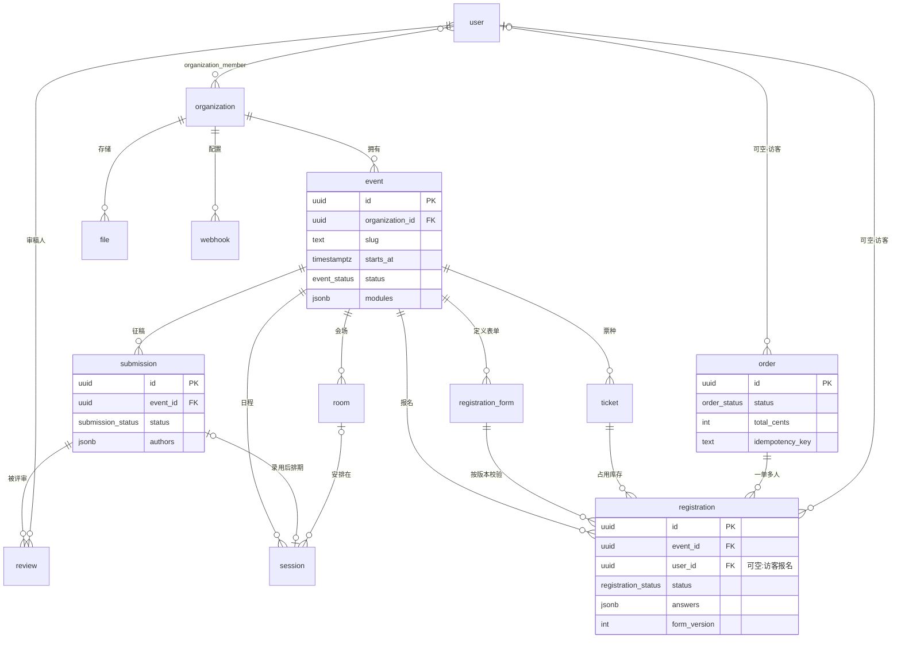

# 第 9 章 · 数据模型

本章定义 yuMeet 的持久层:先给出核心实体的 ER 总览,再以 Drizzle ORM 的 TypeScript schema 写出字段级定义,然后展开自定义字段引擎(JSONB + Zod)、注册与投稿两个关键状态机的完整状态与迁移规则,最后规定审计日志、软删除与数据保留期的落地方式。所有 schema 均以 PostgreSQL 17 为目标,代码位于 monorepo 的 `packages/db`,由 `drizzle-kit` 生成迁移。

## 9.1 ER 总览

建模遵循六条硬性约定:第一,所有业务表都携带归属列(`organization_id`,活动域内再加 `event_id`),这是第 12 章对象级授权中间件能统一校验的前提;第二,主键一律 UUIDv7(`$defaultFn(uuidv7)`,时间有序),插入按时间聚簇,对 B-tree 索引友好;第三,对外 API 与永久链接暴露带类型前缀的编码 ID(`evt_` / `reg_` / `sub_` / `ord_` / `tkt_` / `ses_` / `fil_` + UUIDv7 的 Crockford base32 编码),编解码由 `packages/core` 提供的 `encodeId`/`decodeId` 统一完成,裸 UUID 不出现在 URL 与 API 响应中;第四,所有时间列为 `timestamptz`,只存 UTC,时区换算发生在渲染层(原则 6);第五,金额一律整数分(`price_cents`),不用浮点;第六,面向用户的实体统一软删除(`deleted_at`),表间外键不做级联硬删除。



三个关系值得单独说明:`registration.user_id` 与 `order.user_id` 均可空,访客报名只留 `email`,后续用同一邮箱升级为账户时回填(见 6.1);`order` 与 `registration` 是一对多,承载团体报名——一笔订单下挂多条报名记录,各自独立走状态机;`submission` 与 `session` 是零或一对零或一,录用的投稿被排期时由 `session.submission_id` 关联,日程编排本身见第 5 章。

## 9.2 核心实体字段级定义(Drizzle schema)

命名约定:数据库列 snake_case,TypeScript 属性 camelCase;枚举一律 `pgEnum` 落成真实 PG 枚举类型,新增枚举值通过 `ALTER TYPE … ADD VALUE` 迁移,禁止删改已有值(历史行依赖它);JSONB 列必须通过 `.$type()` 绑定 TypeScript 类型,且写入前必经 Zod 校验(见 9.3)。外键统一显式 `references()`,不配置 `onDelete: 'cascade'`——生命周期由软删除与保留期任务控制,数据库层的级联只会绕过审计。冗余计数列(如 `tickets.quantity_sold`)是有意的反范式,其与事实行的一致性由 13.3 的扣减时序保证。以下按域拆成五个文件展示,第二个文件起省略重复的 import 与 `ts()` 辅助函数。

### 身份域:users 与 organizations

```ts
// packages/db/src/schema/identity.ts
import { sql } from 'drizzle-orm';
import { uuidv7 } from 'uuidv7';
import {
  pgTable, pgEnum, uuid, text, boolean, integer, jsonb,
  timestamp, uniqueIndex, index,
} from 'drizzle-orm/pg-core';

const ts = (name: string) => timestamp(name, { withTimezone: true });
// 主键统一在应用层以 $defaultFn(uuidv7) 生成 UUIDv7(时间有序,见 9.1),
// 不使用数据库端 gen_random_uuid() / defaultRandom() 的 UUID v4

export const userStatus = pgEnum('user_status', ['active', 'suspended', 'anonymized']);

export const users = pgTable('users', {
  id: uuid('id').primaryKey().$defaultFn(uuidv7),
  email: text('email').notNull(),            // 迁移中 ALTER 为 citext:大小写不敏感唯一
  name: text('name'),
  avatarFileId: uuid('avatar_file_id'),
  locale: text('locale').notNull().default('en'),
  timezone: text('timezone').notNull().default('UTC'), // IANA 名,仅为显示偏好
  isGuest: boolean('is_guest').notNull().default(true), // 访客优先:报名不建终身账户(见 6.1)
  status: userStatus('status').notNull().default('active'),
  createdAt: ts('created_at').notNull().defaultNow(),
  updatedAt: ts('updated_at').notNull().defaultNow(),
  deletedAt: ts('deleted_at'),
  anonymizedAt: ts('anonymized_at'),         // 保留期到期后由 worker 填写(见 9.5)
}, (t) => [
  uniqueIndex('users_email_uq').on(t.email).where(sql`${t.deletedAt} IS NULL`),
]);

export const organizations = pgTable('organizations', {
  id: uuid('id').primaryKey().$defaultFn(uuidv7),
  slug: text('slug').notNull(),              // 可读 URL 首段 /acme/…(见 3.4)
  name: text('name').notNull(),
  customDomain: text('custom_domain'),       // 白标域名(见 7.6)
  settings: jsonb('settings').$type<OrgSettings>().notNull().default({}),
  retentionDays: integer('retention_days').notNull().default(730), // 保留期,默认 730 天(与 12.3 权威表一致,见 9.5)
  createdAt: ts('created_at').notNull().defaultNow(),
  updatedAt: ts('updated_at').notNull().defaultNow(),
  deletedAt: ts('deleted_at'),
}, (t) => [uniqueIndex('organizations_slug_uq').on(t.slug)]);
```

### 活动域:events、registration_forms、tickets

```ts
// packages/db/src/schema/event.ts
export const eventStatus = pgEnum('event_status', ['draft', 'published', 'archived']);
// live / ended 是按 starts_at / ends_at 派生的展示态,不入库(见 5.4)
export const eventVisibility = pgEnum('event_visibility', ['public', 'unlisted', 'private']);

export const events = pgTable('events', {
  id: uuid('id').primaryKey().$defaultFn(uuidv7),
  organizationId: uuid('organization_id').notNull().references(() => organizations.id),
  slug: text('slug').notNull(),              // /acme/devconf-2026
  title: text('title').notNull(),
  subtitle: text('subtitle'),
  description: text('description'),          // Markdown 源文
  startsAt: ts('starts_at').notNull(),       // UTC 存储,按浏览者时区渲染
  endsAt: ts('ends_at').notNull(),
  timezone: text('timezone').notNull(),      // 活动官方时区,用于「会场时间」双标注
  venue: jsonb('venue').$type<Venue>(),      // { name, address, geo, online? }
  visibility: eventVisibility('visibility').notNull().default('public'),
  status: eventStatus('status').notNull().default('draft'),
  modules: jsonb('modules').$type<EventModules>().notNull().default({}),
  // 渐进披露开关:{ registration: true, cfp: false, schedule: false, … },见 4.1
  themeId: text('theme_id').notNull().default('cupertino'),
  themeOverrides: jsonb('theme_overrides').$type<TokenOverrides>(), // 见第 7 章
  publishedAt: ts('published_at'),
  archivedAt: ts('archived_at'),             // 归档后永久链接冻结(见 5.4)
  createdAt: ts('created_at').notNull().defaultNow(),
  updatedAt: ts('updated_at').notNull().defaultNow(),
  deletedAt: ts('deleted_at'),
}, (t) => [
  uniqueIndex('events_org_slug_uq').on(t.organizationId, t.slug)
    .where(sql`${t.deletedAt} IS NULL`),
]);

export const registrationForms = pgTable('registration_forms', {
  id: uuid('id').primaryKey().$defaultFn(uuidv7),
  eventId: uuid('event_id').notNull().references(() => events.id),
  name: text('name').notNull(),              // 一个活动可有多张表单(参会/晚宴/工作坊)
  fields: jsonb('fields').$type<FormField[]>().notNull(), // 字段引擎,见 9.3
  version: integer('version').notNull().default(1), // 每次发布 +1,提交侧固定版本
  opensAt: ts('opens_at'),
  closesAt: ts('closes_at'),
  capacity: integer('capacity'),             // null = 不限
  waitlistEnabled: boolean('waitlist_enabled').notNull().default(false),
  approvalRequired: boolean('approval_required').notNull().default(false),
  createdAt: ts('created_at').notNull().defaultNow(),
  updatedAt: ts('updated_at').notNull().defaultNow(),
});

export const tickets = pgTable('tickets', {
  id: uuid('id').primaryKey().$defaultFn(uuidv7),
  eventId: uuid('event_id').notNull().references(() => events.id),
  name: text('name').notNull(),              // Early Bird / Student / Regular
  description: text('description'),
  priceCents: integer('price_cents').notNull().default(0), // 0 = 免费票
  currency: text('currency').notNull().default('EUR'),
  quantityTotal: integer('quantity_total'),  // null = 不限
  quantitySold: integer('quantity_sold').notNull().default(0), // 扣减时序见 13.3
  maxPerOrder: integer('max_per_order').notNull().default(10), // 团体报名上限
  salesOpenAt: ts('sales_open_at'),
  salesCloseAt: ts('sales_close_at'),
  hidden: boolean('hidden').notNull().default(false), // 隐藏票种由优惠码解锁(见 4.2)
  position: integer('position').notNull().default(0),
});
```

### 交易域:registrations 与 orders

```ts
// packages/db/src/schema/registration.ts
export const registrationStatus = pgEnum('registration_status', [
  'pending_review', 'waitlisted', 'awaiting_payment',
  'confirmed', 'checked_in', 'rejected', 'cancelled', 'expired',
]);
export const orderStatus = pgEnum('order_status', [
  'pending', 'paid', 'partially_refunded', 'refunded', 'cancelled', 'expired',
]);

export const orders = pgTable('orders', {
  id: uuid('id').primaryKey().$defaultFn(uuidv7),
  eventId: uuid('event_id').notNull().references(() => events.id),
  userId: uuid('user_id').references(() => users.id), // 可空:访客下单
  email: text('email').notNull(),
  status: orderStatus('status').notNull().default('pending'),
  totalCents: integer('total_cents').notNull(),
  currency: text('currency').notNull(),
  provider: text('provider'),                // 'stripe' | 社区支付插件 id(见 10.5)
  providerRef: text('provider_ref'),         // Checkout Session id 等外部凭据(见 13.3)
  couponCode: text('coupon_code'),
  expiresAt: ts('expires_at'),               // 未支付订单的库存占用期限
  paidAt: ts('paid_at'),
  refundedAt: ts('refunded_at'),
  idempotencyKey: text('idempotency_key'),   // 高并发抢票防重(见 13.3)
  createdAt: ts('created_at').notNull().defaultNow(),
  updatedAt: ts('updated_at').notNull().defaultNow(),
}, (t) => [
  uniqueIndex('orders_idem_uq').on(t.idempotencyKey),
  index('orders_event_status_idx').on(t.eventId, t.status),
]);

export const registrations = pgTable('registrations', {
  id: uuid('id').primaryKey().$defaultFn(uuidv7),
  eventId: uuid('event_id').notNull().references(() => events.id),
  formId: uuid('form_id').notNull().references(() => registrationForms.id),
  formVersion: integer('form_version').notNull(), // 提交时的表单版本,answers 据此解释
  ticketId: uuid('ticket_id').references(() => tickets.id),
  orderId: uuid('order_id').references(() => orders.id), // 免费报名时为空
  userId: uuid('user_id').references(() => users.id),    // 可空:访客报名
  email: text('email').notNull(),
  answers: jsonb('answers').$type<Record<string, unknown>>().notNull(),
  status: registrationStatus('status').notNull(),
  waitlistPosition: integer('waitlist_position'),
  confirmationCode: text('confirmation_code').notNull(), // 8 位短码:签到与人工查询
  accessTokenHash: text('access_token_hash').notNull(),  // 免登录状态追踪页凭证(见 5.5)
  confirmedAt: ts('confirmed_at'),
  checkedInAt: ts('checked_in_at'),
  cancelledAt: ts('cancelled_at'),
  createdAt: ts('created_at').notNull().defaultNow(),
  updatedAt: ts('updated_at').notNull().defaultNow(),
}, (t) => [
  // 同一表单同一邮箱仅一条「活跃」报名,取消/过期后可重报
  uniqueIndex('registrations_form_email_uq').on(t.formId, t.email)
    .where(sql`${t.status} NOT IN ('cancelled', 'expired', 'rejected')`),
  index('registrations_event_status_idx').on(t.eventId, t.status),
]);
```

### 征稿域:submissions 与 reviews

```ts
// packages/db/src/schema/cfp.ts
export const submissionStatus = pgEnum('submission_status', [
  'draft', 'submitted', 'under_review', 'changes_requested',
  'accepted', 'confirmed', 'scheduled', 'rejected', 'withdrawn',
]);
export const reviewStatus = pgEnum('review_status', ['assigned', 'draft', 'submitted']);

export const submissions = pgTable('submissions', {
  id: uuid('id').primaryKey().$defaultFn(uuidv7),
  eventId: uuid('event_id').notNull().references(() => events.id),
  track: text('track'),                      // CFP 配置定义的轨道 id
  type: text('type').notNull(),              // talk / poster / workshop,由 CFP 配置枚举
  title: text('title').notNull(),
  abstract: text('abstract').notNull(),
  authors: jsonb('authors').$type<Author[]>().notNull(),
  // [{ name, email, affiliation, isPresenter, userId? }]
  // 双盲模式下 API 层对审稿人角色整体裁剪该列(见 4.3 与 12.2)
  answers: jsonb('answers').$type<Record<string, unknown>>().notNull().default({}),
  // CFP 自定义问题复用 9.3 字段引擎
  status: submissionStatus('status').notNull().default('draft'),
  submittedAt: ts('submitted_at'),
  decidedAt: ts('decided_at'),
  withdrawnAt: ts('withdrawn_at'),
  createdAt: ts('created_at').notNull().defaultNow(),
  updatedAt: ts('updated_at').notNull().defaultNow(),
  deletedAt: ts('deleted_at'),
}, (t) => [index('submissions_event_status_idx').on(t.eventId, t.status)]);

export const reviews = pgTable('reviews', {
  id: uuid('id').primaryKey().$defaultFn(uuidv7),
  submissionId: uuid('submission_id').notNull().references(() => submissions.id),
  reviewerId: uuid('reviewer_id').notNull().references(() => users.id),
  scores: jsonb('scores').$type<Record<string, number>>().notNull().default({}),
  // 键为 CFP 配置的评分维度 id(见 4.3),如 { relevance: 4, clarity: 5 }
  confidence: integer('confidence'),         // 1–5
  commentForCommittee: text('comment_for_committee'),
  commentForAuthors: text('comment_for_authors'),
  isConflict: boolean('is_conflict').notNull().default(false),
  // 审稿人自报利益冲突后,应用层立即撤销其对该投稿的读权限
  status: reviewStatus('status').notNull().default('assigned'),
  submittedAt: ts('submitted_at'),
  createdAt: ts('created_at').notNull().defaultNow(),
  updatedAt: ts('updated_at').notNull().defaultNow(),
}, (t) => [uniqueIndex('reviews_sub_reviewer_uq').on(t.submissionId, t.reviewerId)]);
```

### 日程与基础设施域:rooms、sessions、files、webhooks

```ts
// packages/db/src/schema/schedule.ts / infra.ts(节选)
export const rooms = pgTable('rooms', {
  id: uuid('id').primaryKey().$defaultFn(uuidv7),
  eventId: uuid('event_id').notNull().references(() => events.id),
  name: text('name').notNull(),
  capacity: integer('capacity'),
  location: text('location'),                // 楼层/导览说明
  equipment: jsonb('equipment').$type<string[]>().notNull().default([]),
  position: integer('position').notNull().default(0), // 多轨时间表列序(见 5.1)
});

export const sessions = pgTable('sessions', {
  id: uuid('id').primaryKey().$defaultFn(uuidv7),
  eventId: uuid('event_id').notNull().references(() => events.id),
  roomId: uuid('room_id').references(() => rooms.id),
  submissionId: uuid('submission_id').references(() => submissions.id),
  parentId: uuid('parent_id'),               // 会话块嵌套:block 内含多个 contribution
  title: text('title').notNull(),
  kind: text('kind').notNull().default('talk'), // talk/keynote/break/poster/social
  startsAt: ts('starts_at').notNull(),       // UTC;冲突检测按 (roomId, 时间区间) 重叠判定
  endsAt: ts('ends_at').notNull(),
  speakers: jsonb('speakers').$type<SessionSpeaker[]>().notNull().default([]),
  createdAt: ts('created_at').notNull().defaultNow(),
  updatedAt: ts('updated_at').notNull().defaultNow(),
  deletedAt: ts('deleted_at'),
}, (t) => [index('sessions_event_time_idx').on(t.eventId, t.startsAt)]);

export const fileScanStatus = pgEnum('file_scan_status', ['pending', 'clean', 'infected']);

export const files = pgTable('files', {
  id: uuid('id').primaryKey().$defaultFn(uuidv7),
  organizationId: uuid('organization_id').notNull().references(() => organizations.id),
  eventId: uuid('event_id').references(() => events.id),
  uploaderId: uuid('uploader_id').references(() => users.id),
  bucket: text('bucket').notNull().default('yumeet'),
  key: text('key').notNull(),                // org/{orgId}/event/{eventId}/{uuid}/{name}
  filename: text('filename').notNull(),
  contentType: text('content_type').notNull(),
  sizeBytes: bigint('size_bytes', { mode: 'number' }).notNull(),
  sha256: text('sha256').notNull(),          // 去重与完整性校验
  scanStatus: fileScanStatus('scan_status').notNull().default('pending'), // 见 12.2
  isPublic: boolean('is_public').notNull().default(false),
  createdAt: ts('created_at').notNull().defaultNow(),
  deletedAt: ts('deleted_at'),
});

export const webhooks = pgTable('webhooks', {
  id: uuid('id').primaryKey().$defaultFn(uuidv7),
  organizationId: uuid('organization_id').notNull().references(() => organizations.id),
  url: text('url').notNull(),                // 出站前经 SSRF 防护校验(见 12.1)
  secretEncrypted: text('secret_encrypted').notNull(), // AES-256-GCM;HMAC 签名见 10.3
  events: text('events').array().notNull(),  // ['registration.confirmed', …] 完整事件表见 10.3
  active: boolean('active').notNull().default(true),
  failureCount: integer('failure_count').notNull().default(0),
  disabledAt: ts('disabled_at'),             // 连续 5 天所有投递均失败时自动暂停并邮件告知(见 10.3)
  createdAt: ts('created_at').notNull().defaultNow(),
});
```

日程的草稿/发布双版本不在 `sessions` 表上做标记:编排器通过 Yjs 直接编辑草稿(文档定期落库),「发布」动作把当前 sessions 集合快照为一条 `schedule_snapshots` JSONB 记录,公共页只读最近快照,细节见 5.1。`organization_member`(组织角色)与权限能力表在第 6 章定义,此处不重复。

## 9.3 自定义字段引擎(JSONB + Zod)

组织者自定义的表单字段不进真实列——那是 Indico 式 schema 膨胀的起点。注册表单与 CFP 问卷共用同一个字段引擎:字段定义存于 `registration_forms.fields`(JSONB 数组),答案存于 `registrations.answers` / `submissions.answers`(JSONB 对象,键为字段 `key`)。字段定义是一个可辨识联合类型,共 15 种 `kind`,与 4.2 字段类型表一一对应:`short_text`、`long_text`、`email`、`phone`、`number`、`date`、`select`、`radio`、`checkbox_group`、`boolean`、`country`、`url`、`file`、`affiliation`、`capacity_option`;前端渲染器与服务端校验器消费同一份定义,不存在两套字段描述漂移的可能。以下为 15 种 kind 的关键子集,完整可辨识联合定义于 `packages/core/src/forms/types.ts`:

```ts
// packages/core/src/forms/types.ts(关键子集;15 种 kind 的完整联合定义见该文件)
export type FormField =
  | { kind: 'short_text'; key: string; label: I18nString; required?: boolean;
      maxLength?: number; pii?: boolean; visibleWhen?: Condition }
  | { kind: 'email'; key: string; label: I18nString; required?: boolean; pii: true }
  | { kind: 'phone'; key: string; label: I18nString; required?: boolean; pii: true }
    // 存 E.164,libphonenumber 校验(见 4.2)
  | { kind: 'select'; key: string; label: I18nString; required?: boolean;
      options: { value: string; label: I18nString }[] }
  | { kind: 'boolean'; key: string; label: I18nString; required?: boolean;
      consent?: { legalTextId: string; version: number } }
    // consent 变体:绑定法律文本及其版本号,勾选时间入审计日志(见 4.2)
  | { kind: 'number'; key: string; label: I18nString; min?: number; max?: number }
  | { kind: 'date'; key: string; label: I18nString; required?: boolean }
  | { kind: 'country'; key: string; label: I18nString; required?: boolean; pii?: boolean }
  | { kind: 'affiliation'; key: string; label: I18nString; required?: boolean;
      pii?: boolean }                    // 值为 { name, rorId? }:ROR 自动补全,允许自由文本
  | { kind: 'capacity_option'; key: string; label: I18nString; required?: boolean;
      options: { value: string; label: I18nString;
                 capacity: number | null; waitlist?: boolean }[] }
    // 选项级库存(晚宴/工作坊),余量扣减遵循 13.3 的时序
  | { kind: 'file'; key: string; label: I18nString; accept?: string[]; maxSizeMb?: number };
// 其余 kind(long_text、radio、checkbox_group、url)定义同构,此处从略
// pii: true 的字段参与 9.5 的匿名化清除;visibleWhen 条件逻辑见 4.2

// 运行时把字段定义编译为 Zod schema,服务端提交校验的唯一入口
export function fieldsToZod(fields: FormField[]) {
  const shape: Record<string, z.ZodTypeAny> = {};
  for (const f of fields) {
    let s: z.ZodTypeAny;
    switch (f.kind) {
      case 'short_text': s = z.string().trim().max(f.maxLength ?? 500); break;
      case 'email':   s = z.string().email(); break;
      case 'phone':   s = z.string().regex(/^\+[1-9]\d{1,14}$/); break; // E.164;深校验用 libphonenumber refine
      case 'number':  s = z.number().min(f.min ?? -1e9).max(f.max ?? 1e9); break;
      case 'select': {
        const values = f.options.map((o) => o.value) as [string, ...string[]];
        s = z.enum(values); break;
      }
      case 'boolean':
        // consent 变体且必填时必须勾选为 true,不同意即无法提交
        s = f.consent && f.required ? z.literal(true) : z.boolean(); break;
      case 'date':     s = z.string().date(); break;
      case 'country':  s = z.string().length(2); break;   // ISO 3166-1 alpha-2
      case 'affiliation':
        s = z.object({ name: z.string().trim().min(1),
                       rorId: z.string().optional() }); break;
      case 'capacity_option': {
        const values = f.options.map((o) => o.value) as [string, ...string[]];
        s = z.enum(values); break; // 余量校验不在 schema 层,在事务内随库存扣减完成(见 13.3)
      }
      case 'file':     s = z.string().uuid(); break;      // 引用 files.id
    }
    shape[f.key] = f.required ? s : s.optional();
  }
  return z.object(shape).strict(); // strict:拒绝任何未声明的键
}
```

版本固定是这套引擎不出错的关键:表单每次发布 `version + 1` 并把历史版本的 `fields` 追加进 `registration_form_revisions`;每条 `registration` 记录 `form_version`,导出与渲染永远用提交当时的定义解释 `answers`,组织者事后改表单不会让旧数据失去语义。查询侧默认建 GIN 索引,统计高频字段时再物化为生成列:

```sql
CREATE INDEX registrations_answers_gin
  ON registrations USING GIN (answers jsonb_path_ops);

-- 高频筛选字段(如餐食偏好)按需提升为生成列,可建普通 B-tree 索引
ALTER TABLE registrations
  ADD COLUMN dietary text GENERATED ALWAYS AS (answers->>'dietary') STORED;
```

> **Indico 的教训** Indico 的注册数据横跨表单条目、字段配置与答案多张关联表,字段结构变更后历史数据的解释依赖运行时代码兼容,导出一张报名表要做多层 join,自定义字段也难以索引。yuMeet 用「JSONB 答案 + 版本固定的字段定义 + `strict()` Zod 校验」把三个问题一次解决:结构自描述、历史可解释、查询可索引。

## 9.4 关键状态机:注册与投稿

两个状态机集中定义在 `packages/core`,数据库不使用触发器——触发器把业务规则藏进不可调试、不可灰度的角落,与「状态透明」原则冲突。所有状态变更必须经过唯一的 `transition()` 函数:先查迁移表校验合法性,再在同一事务内更新行、写入 `audit_logs`,最后向 BullMQ 投递副作用任务(邮件、webhook、SSE 推送)。任何不在下表中的迁移抛 `InvalidTransitionError`,API 层映射为 409;终态(表中目标列为空的状态)行不可再变更。参会者看到的「像查快递」进度页(见 5.5)就是按 `target_id` 回放审计日志中的状态变更序列,不需要额外的历史表。

### 注册状态机

- `pending_review` 待审批(`approvalRequired` 开启时的入口态)
- `waitlisted` 候补中(名额已满且候补开启)
- `awaiting_payment` 待支付(库存已占用,订单 `expiresAt` 内有效)
- `confirmed` 已确认
- `checked_in` 已签到(终态)
- `rejected` 已拒绝(终态)
- `cancelled` 已取消(终态)
- `expired` 已过期(终态;超时未支付或递补窗口超时)

| 当前状态 | 目标状态 | 触发 | 前置条件(guard) | 副作用 |
| --- | --- | --- | --- | --- |
| (创建) | confirmed | 提交表单 | 免费票、免审批、有名额 | 确认邮件 + ICS 附件;`quantity_sold + 1` |
| (创建) | awaiting_payment | 提交表单 | 付费票、免审批、有名额 | 创建 order(30 分钟过期);占用库存 |
| (创建) | pending_review | 提交表单 | `approvalRequired = true` | 通知组织者;申请人收到「审批中」追踪链接 |
| (创建) | waitlisted | 提交表单 | 名额满且 `waitlistEnabled` | 发候补位次邮件 |
| pending_review | awaiting_payment | 组织者批准 | 票价 > 0 | 发支付链接邮件;创建 order 并占库存 |
| pending_review | confirmed | 组织者批准 | 免费票 | 确认邮件 + ICS |
| pending_review | rejected | 组织者拒绝 | 需填拒绝理由 | 拒绝邮件(含理由) |
| pending_review | cancelled | 申请人撤回 | — | — |
| awaiting_payment | confirmed | `order.paid` webhook | 金额与订单一致 | 确认邮件 + 收据;webhook `registration.confirmed` |
| awaiting_payment | expired | worker 定时扫描 | 超过 `order.expiresAt` | 释放库存;触发候补递补 |
| awaiting_payment | cancelled | 用户取消 | — | 取消 order;释放库存;触发递补 |
| waitlisted | awaiting_payment | 递补(付费票) | 按位次;24 小时接受窗口 | 递补邀请邮件;占用库存 |
| waitlisted | confirmed | 递补(免费票) | 按位次自动 | 确认邮件;后续位次前移 |
| waitlisted | cancelled | 用户退出候补 | — | 后续位次前移 |
| waitlisted | expired | 递补窗口超时 | 24 小时未响应 | 名额转给下一位 |
| confirmed | cancelled | 用户或组织者取消 | 在退款政策窗口内 | 按政策退款;释放库存;触发递补 |
| confirmed | checked_in | 现场扫码(见 5.2) | 活动进行期间 | 写 `checked_in_at`;会场屏人数 SSE 更新 |

### 投稿状态机

- `draft` 草稿(作者可反复编辑,自动保存)
- `submitted` 已提交(截止前可解锁改回草稿)
- `under_review` 评审中(已分配审稿人)
- `changes_requested` 待修改(评审要求作者修订)
- `accepted` 已录用(待讲者确认)
- `confirmed` 讲者已确认出席
- `scheduled` 已排期(与 session 关联)
- `rejected` 已拒绝(终态)
- `withdrawn` 已撤回(终态;作者在任意非终态可触发)

| 当前状态 | 目标状态 | 触发 | 前置条件(guard) | 副作用 |
| --- | --- | --- | --- | --- |
| (创建) | draft | 作者开始填写 | CFP 开放中 | — |
| draft | submitted | 作者提交 | CFP 截止前;必填字段完整 | 回执邮件;写 `submitted_at` |
| submitted | draft | 作者解锁编辑 | CFP 截止前 | — |
| submitted | under_review | 组织者分配审稿人 | 无利益冲突(自动检测 + 自报,见 4.3) | 为每位审稿人建 `assigned` 状态 review 行 |
| under_review | changes_requested | PC 主席要求修订 | 附修订意见 | 作者收到修订邮件与截止时间 |
| changes_requested | under_review | 作者提交修订版 | 修订截止前 | 审稿人收到更新通知 |
| under_review | accepted | 录用决议 | 评审数达到 CFP 配置下限 | 录用邮件(可批量延迟统一发送);写 `decided_at` |
| under_review | rejected | 拒绝决议 | 同上 | 拒绝邮件(可含匿名化评语) |
| accepted | confirmed | 讲者点击确认出席 | 确认截止前 | 自动创建/关联讲者的免费报名 |
| confirmed | scheduled | 排入日程(见 5.1) | 存在关联 session | 公共日程页 ISR 重新生成 |
| draft / submitted / under_review / changes_requested / accepted / confirmed | withdrawn | 作者撤回 | — | 通知组织者;进行中的 review 关闭 |
| scheduled | withdrawn | 讲者临时取消 | 组织者确认 | session 标注取消;日程页更新 + SSE 公告 |

```ts
// packages/core/src/state/registration.ts(投稿侧同构,略)
export const REGISTRATION_FLOW: Record<RegStatus, readonly RegStatus[]> = {
  pending_review:   ['awaiting_payment', 'confirmed', 'rejected', 'cancelled'],
  waitlisted:       ['awaiting_payment', 'confirmed', 'cancelled', 'expired'],
  awaiting_payment: ['confirmed', 'expired', 'cancelled'],
  confirmed:        ['checked_in', 'cancelled'],
  checked_in: [], rejected: [], cancelled: [], expired: [],
};

export async function transition(id: string, to: RegStatus, actor: Actor, ctx: Tx) {
  const reg = await ctx.lockRow(registrations, id);       // SELECT … FOR UPDATE
  if (!REGISTRATION_FLOW[reg.status].includes(to)) {
    throw new InvalidTransitionError(reg.status, to);
  }
  await ctx.update(registrations, id, { status: to });
  await audit(ctx, actor, `registration.${to}`, 'registration', id);
  await enqueueSideEffects(reg, to);  // 邮件 / webhook / SSE,事务提交后投递
}
```

> **设计要点** 迁移合法性校验与行级锁在同一事务内完成,杜绝并发下的双重递补或重复确认;副作用任务在事务提交后才入队(BullMQ 的 flow + outbox 表),保证「状态已变但邮件未发」可重试,而不会出现「邮件已发但状态回滚」。

## 9.5 审计、软删除与数据保留期

审计日志是独立的追加型表,记录所有写操作与敏感读操作(如名单导出),并以哈希链保证事后可验证未被篡改——每条记录的 `hash` 由前一条 `hash` 与本条规范化内容共同计算,任何中间改写都会使后续链条校验失败,验证工具与合规要求见 12.5。

```ts
// packages/db/src/schema/audit.ts
export const auditLogs = pgTable('audit_logs', {
  id: bigserial('id', { mode: 'number' }).primaryKey(), // 单调序,链式校验依赖插入顺序
  organizationId: uuid('organization_id').notNull(),
  eventId: uuid('event_id'),
  actorType: text('actor_type').notNull(),   // 'user' | 'api_key' | 'system'
  actorId: uuid('actor_id'),
  action: text('action').notNull(),          // 'registration.confirmed' 等,与 10.3 webhook 事件同命名空间
  targetType: text('target_type').notNull(),
  targetId: uuid('target_id').notNull(),
  diff: jsonb('diff'),                       // 变更前后差异;pii: true 字段写入前脱敏
  ip: text('ip'),
  prevHash: text('prev_hash').notNull(),
  hash: text('hash').notNull(),              // SHA-256(prevHash + canonical(payload))
  createdAt: ts('created_at').notNull().defaultNow(),
}, (t) => [index('audit_target_idx').on(t.targetType, t.targetId, t.createdAt)]);
```

  
```sql
-- 迁移中执行:应用账号只能追加与读取,数据库层面禁止改写历史
REVOKE UPDATE, DELETE ON audit_logs FROM yumeet_app;
```

软删除的约定:面向用户的实体(users、events、submissions、sessions、files 等)带 `deleted_at`,查询经 `packages/db` 导出的 `notDeleted()` 辅助条件过滤;唯一索引一律加 `WHERE deleted_at IS NULL` 部分索引,使删除后同名资源可重建(9.2 中 `users_email_uq`、`events_org_slug_uq` 即此写法)。交易与审计类表(orders、registrations、audit_logs)不软删除——它们用状态机终态表达生命周期结束,物理清理只由保留期任务执行。

各类数据的默认保留期与到期动作以 12.3 的权威表为准,worker 任务 `data-retention`(BullMQ repeatable job)每日 04:00 UTC 按该表执行;报名 PII 按组织的 `retention_days` 处理,其默认值 730 与 12.3 一致。「匿名化」指:`email` 替换为 `anon-{id}@invalid`、`name` 置为占位符、`answers` 中所有 `pii: true` 字段清空,同时保留计数与非 PII 统计维度,归档页的历史数据(原则 7)因此不受影响。

> **Indico 的教训** Indico 曾出现用户资料可被批量枚举导出的漏洞(对照 12.1),且 GDPR 能力属于后补。yuMeet 在数据层的对应设计是:PII 冗余最小化(访客只存一个 email)、每张表贯穿归属列使对象级授权可统一强制、`pii` 标记让匿名化成为逐字段确定性操作、保留期清理默认开启而非可选——「默认即合规」(原则 5)首先是 schema 的属性,其次才是功能。GDPR 各项权利的产品化实现见 12.4。
